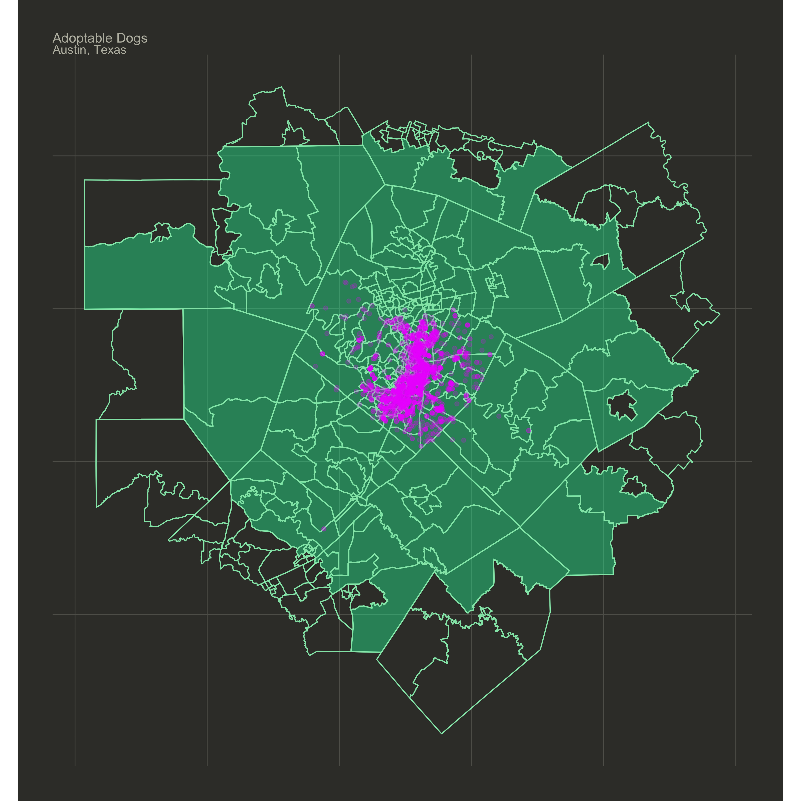
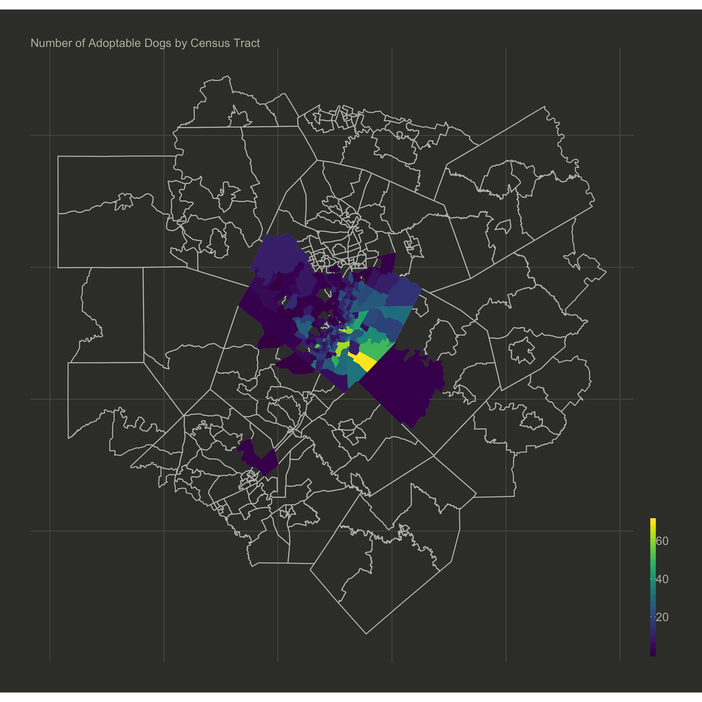
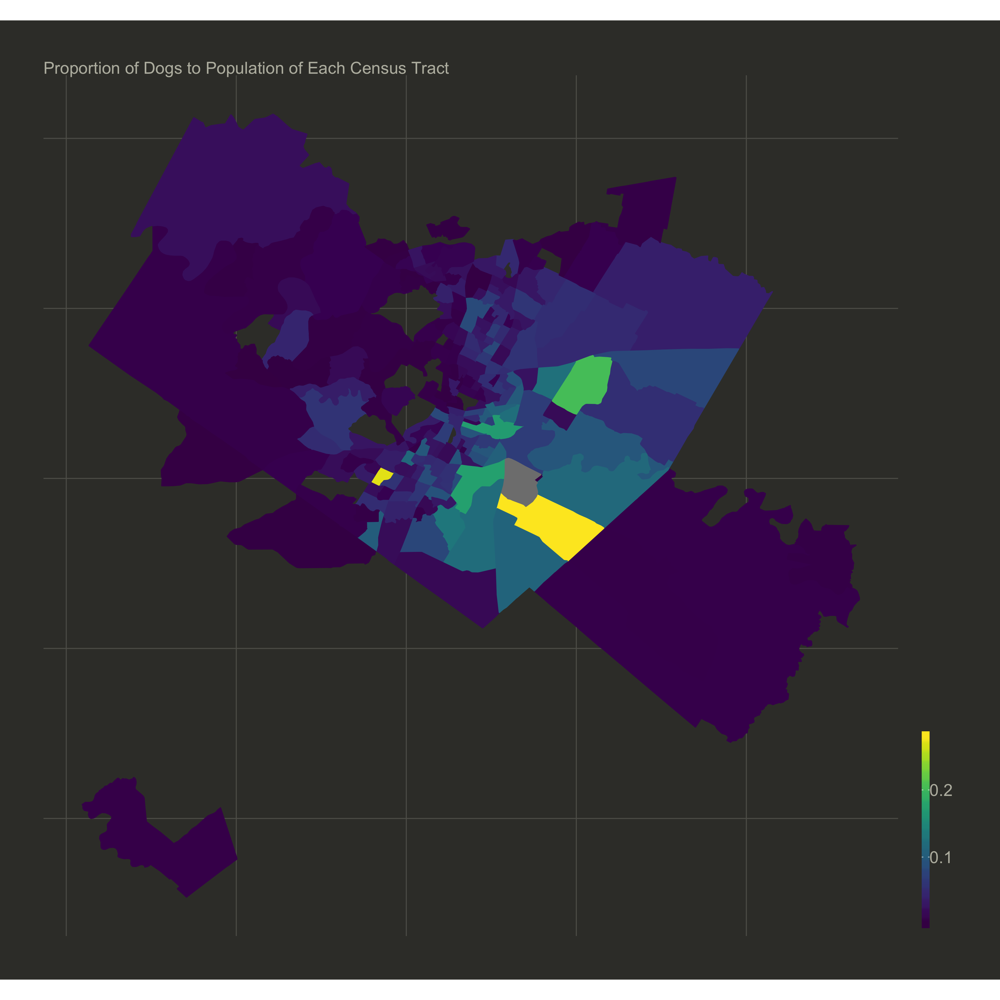

Dogs are a central part of my life. I have a friend from Germany who likes to think of his life as "Life Pie", or the idea that our life is a pie and certain slices are eaten up by certain activities. The more time consuming the activity, the bigger the life pie slice. Well, I'd say dogs take up about a quarter of my "life pie". Take that tidbit as you will. 

...

I got motivated to attempt a side project this week. Recently these have been hard for me to come by as I've been rather preoccupied with writing my disseration, but I did come across a Tweet this week [original tweet here](https://twitter.com/jhnmxwll/status/999347713165570048) in which the company Rover.com has created an internal `R` package for their analyses. That got me to thinking, if a quarter of my "life pie" is constantly being consumed by dogs then I must like them enough. Why haven't a tried an analysis. Well, this is that and here we are...an analysis of adoptable dogs.

```{r, warning=FALSE}
library(dplyr)
library(tidyr)
library(readr)
library(lubridate)
library(stringr)
library(ggplot2)
library(ggmap)
library(sf)
library(tidycensus)
library(haterzmapper)
library(viridis)
```

So I sought out data on dogs. I stumbled upon a couple but this one opened my eyelids. I saw addresses and I knew that I could do a spatial analysis (about 1/7th of my life-pie right now). The data is about shelter dogs and cats and where they are found and was posted by Rachel Downs and can be found here [here](https://data.world/rdowns26/austin-animal-shelter). Thanks, Rachel.

```{r}
df <- read_csv("../rawdata/all_records.csv")
head(df, 10)
```
## Data Preprocessing

The first round of preprocessing is rather straight forward but we can discuss my motivation anyhow. Dogs are just the best. I've known nothing truer in my entire life. Geospatial analysis is also among my favorites (because MAPS). The rest was simple, I wanted to perform a visual geospatial analysis on dog data. BOOM! Here we are. 

These data contain addresses, which is a great start but it would be better if I had access to coordinates. Whoops! That wasn't simple. Since I'm not a `ggmap` savant, my development process of using `geocode` ended rather abruptly when I attempted to many requests. Disappointing? Yes. Did it stop me? Almost. But alas, I trudged forward and found that where Google had let me down in one respect, it lifted me back up in another. I googled for my next solution and *SPOILER ALERT* someone had written a rather nice fuction for pulling geocode data from the api. Long story short, I borrowed it.

Before I had all of that fun, I need to clean up the address that I had at my disposal. The first step was to take those that had specific addresses. Many had just a city reference, which is a total bummer. For those that did have an address they weren't quite in a state that would be acceptable for our knockoff `geocode` function. So I clean up this column so that we just had addresses and those address were in the standard addressy format: <unit number> <street>, <city>, <state abbreviation>.

Next step was to filter on dogs. In hindsight, I should have done this first but I didn't. You win some. You lose some. Also, no offense to cat people out there. I like 'em... but... dogs. 
```{r}
df1 <- df %>%
  filter(str_detect(Found_Location, "\\sin\\s")) %>%
  mutate(address = str_replace(Found_Location, "\\sin\\s", ", ")) %>%
  mutate(address = str_replace(address, "\\s\\(", ", ")) %>% 
  mutate(address = str_remove(address, "\\)"))

# find only dogs
dogs <- df1 %>%
  filter(Animal_Type_intake == 'Dog')
```

Here's the the function borrowing that I was talking about. Shout out to `christoph` on StackOverflow for making this all possible [here](https://stackoverflow.com/questions/32504880/street-address-to-geolocation-lat-long). Bravo! 

```{r, eval=FALSE}
# borrow function found:
# https://stackoverflow.com/questions/32504880/street-address-to-geolocation-lat-long
get_geocode <- function(address) {
  url = "http://maps.google.com/maps/api/geocode/json?address="
  url = URLencode(paste(url, address, "&sensor=false", sep = ""))
  x = RJSONIO::fromJSON(url, simplify = FALSE)
  if (x$status == "OK") {
    out = c(x$results[[1]]$geometry$location$lng,
             x$results[[1]]$geometry$location$lat)
  } else {
    out = NA
  }
  Sys.sleep(0.2)  # API only allows 5 requests per second
  out
}

# find geocodes
result3 <- sapply(dogs$address[7001:20000], get_geocode)
```

```{r}
load('~/Dropbox/dog_coords.rda')
load('~/Dropbox/dog_coords2.rda')
```

```{r}
coord_names <- c("lon", "lat")
coords <- data.frame(t(as.data.frame(result)))
names(coords) <- coord_names
coords2 <- data.frame(t(as.data.frame(result2)))
names(coords2) <- coord_names

dogs1 <- cbind(dogs[1:1890,],coords[1:1890,])
dogs2 <- cbind(dogs[1891:7000,], coords2)

dogs <- rbind(dogs1, dogs2)
dogs <- dogs[complete.cases(dogs$lat),]
```

```{r}
aust_coords <- list(lon = -97.7431, lat = 30.2672)
dogs_sf <- st_as_sf(dogs, coords = c("lon", "lat"), crs = 4326)
dogs_sf <- subset_map(dogs_sf, long = aust_coords$lon , lat = aust_coords$lat, dist = 70000)
```

## Gathering the map data

There are a number of ways to collect shapefiles for mapping but I've been really impressed by the ease of use of `tidycensus`. Checkout my first two posts for evidence. It makes collecting Census and American Community Survey data extreeeeeeemely simple and it provides the option to provide the simple feature as well, which makes becoming a cartographer seem like rather reasonable career shift. But I don't want all of Texas, I just need Austin and the surrounding areas. Let's just say a 70 kilometer radius around the center coordinates of the city will do the trick. Well, I wrote a small package the extends the functionality of `sf` and allows me to simply subset a `simple feature` data frame to only those rows that are within a certain distance of some given coordinates.
```{r}
# collect all cencus tracts for texas
tx <- get_acs(geography = "tract", variables = "B00001_001",
              state = "TX", geometry = TRUE)

# subset for only 70km radius around austin
austin <- subset_map(tx, long = aust_coords$lon , lat = aust_coords$lat, dist = 70000)
outer <- subset_map(tx, long = aust_coords$lon , lat = aust_coords$lat, dist = 90000)
austin <- austin %>% st_transform(crs = 4326)
outer <- outer %>% st_transform(crs = 4326)
dogs_sf <- dogs_sf %>% st_transform(crs = 4326)
```

```{r, fig.height=10, fig.width=10}
ggplot() + 
  geom_sf(data = outer, colour = '#92e5b5', fill = "#00ffa9", alpha = 0) +
  geom_sf(data = austin, colour = '#92e5b5', fill = "#00ffa9", alpha = .4) +
  geom_sf(data = dogs_sf, colour = '#ef1cff', alpha = .2) +
  map_theme_space() +
  ggtitle("Adoptable Dogs", subtitle = "Austin, Texas")

# ggsave("../figures/doggo_coords.png", dpi = "retina", height = 10, width = 10)
```



```{r, fig.height=10, fig.width=10}
intersection <- st_intersection(dogs_sf, austin) 

st_geometry(intersection) <- NULL


dog_count <- intersection %>%
  group_by(GEOID) %>%
  tally() %>%
  left_join(austin)

ggplot() + 
  geom_sf(data = outer, colour = 'grey', fill = "grey", alpha = 0) +
  geom_sf(data = dog_count, aes(fill = n,  colour = n)) +
  map_theme_space() + 
  scale_fill_viridis() +
  scale_fill_viridis() +
  ggtitle("Number of Adoptable Dogs by Census Tract")

# ggsave("../figures/doggo_nums.png", dpi = "retina", height = 10, width = 10)
```



```{r, fig.height=10, fig.width=10}
dog_count %>% 
  mutate(prop = n/estimate) %>%
  ggplot() +
  geom_sf(aes(fill = prop, colour = prop)) + 
  map_theme_space() +
  scale_fill_viridis() + 
  scale_color_viridis() + 
  ggtitle("Proportion of Dogs to Population of Each Census Tract")

# ggsave("../figures/doggo_props.png", dpi = "retina", height = 10, width = 10)
```

